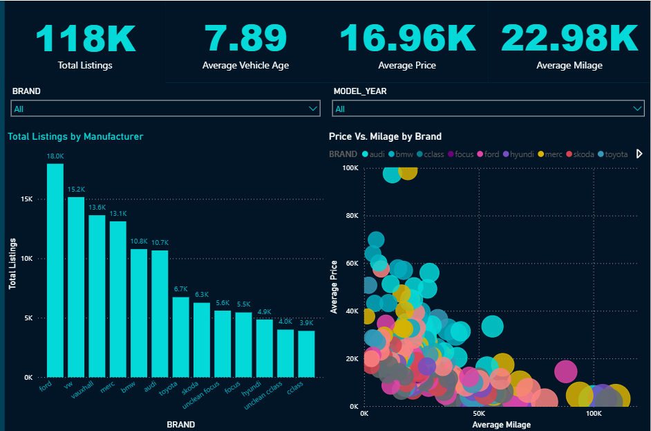

# Automotive Market Analytics 🚗

## 📋 Project Overview

This end-to-end data analytics project provides a comprehensive overview of the used car market in the UK. The goal was to build a complete data pipeline, starting from raw, disparate data files and ending with a clean, interactive Power BI dashboard for business stakeholders.

This project demonstrates a full range of modern data skills, including data cleaning, cloud data warehousing, data modeling, and business intelligence.

## 🛠️ Tech Stack

* **Data Cleaning & Preparation**: Python (Pandas), Scikit-learn
* **Cloud Data Warehouse**: Snowflake
* **Data Transformation & Modeling**: dbt (Data Build Tool) & SQL
* **Data Visualization**: Power BI & DAX
* **Version Control**: Git & GitHub

## 🔄 Project Workflow

1.  **Data Ingestion & Cleaning**: Loaded 9 separate raw CSV files using Python, combined them into a single dataset, standardized column names, corrected complex data type issues, and imputed missing values using a Linear Regression model for MPG.
2.  **Data Warehousing**: The cleaned dataset was uploaded to a `RAW` schema in Snowflake.
3.  **Data Modeling (dbt)**: A dbt project was used to transform the data into a relational **star schema**.
    * **Staging Models**: Cleaned, cast, and standardized the raw data into a reliable base layer.
    * **Dimension Models**: Created `dim_cars`, `dim_engines`, and `dim_transmissions`.
    * **Fact Model**: Created `fct_listings` to hold quantitative measures and foreign keys.
4.  **Data Visualization (Power BI)**: Connected Power BI to the final dbt models in Snowflake using **DirectQuery**. A multi-page interactive dashboard was built with a custom dark theme to analyze market trends, supported by robust DAX measures.

## 📊 Dashboard Preview

---